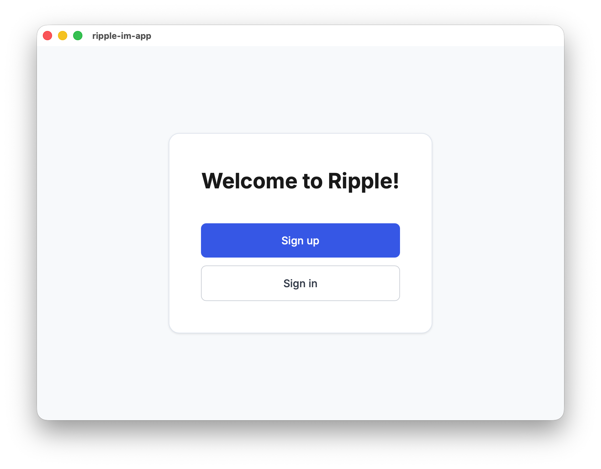
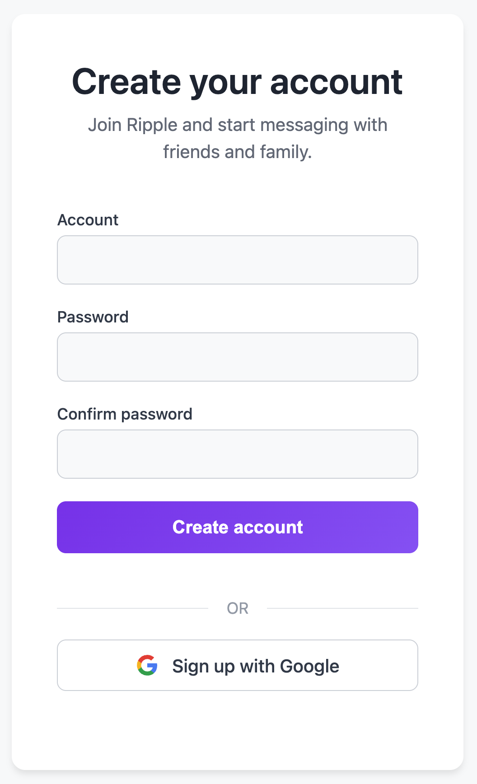
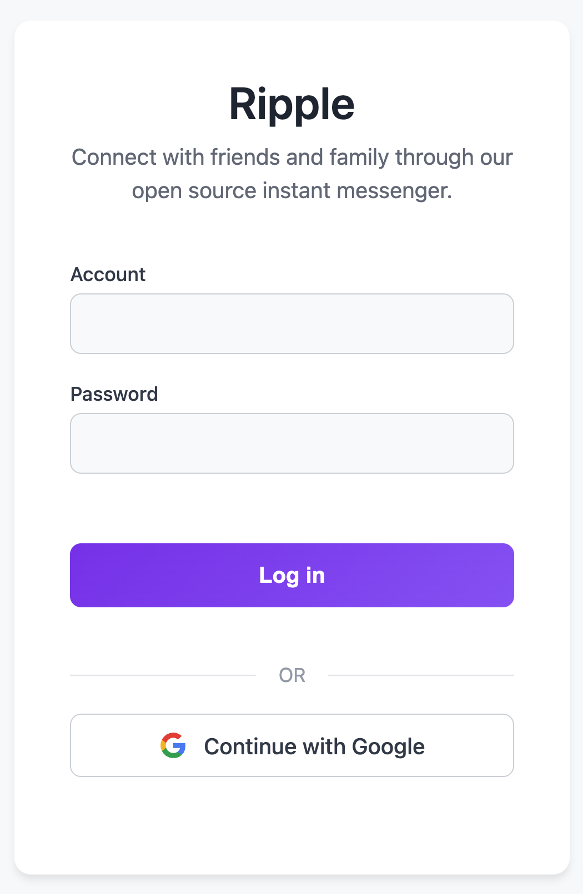
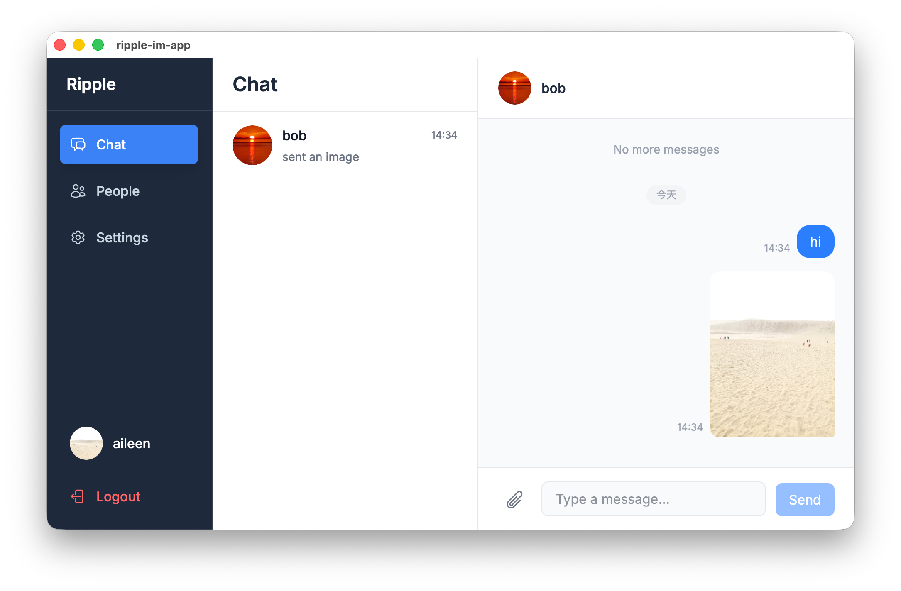
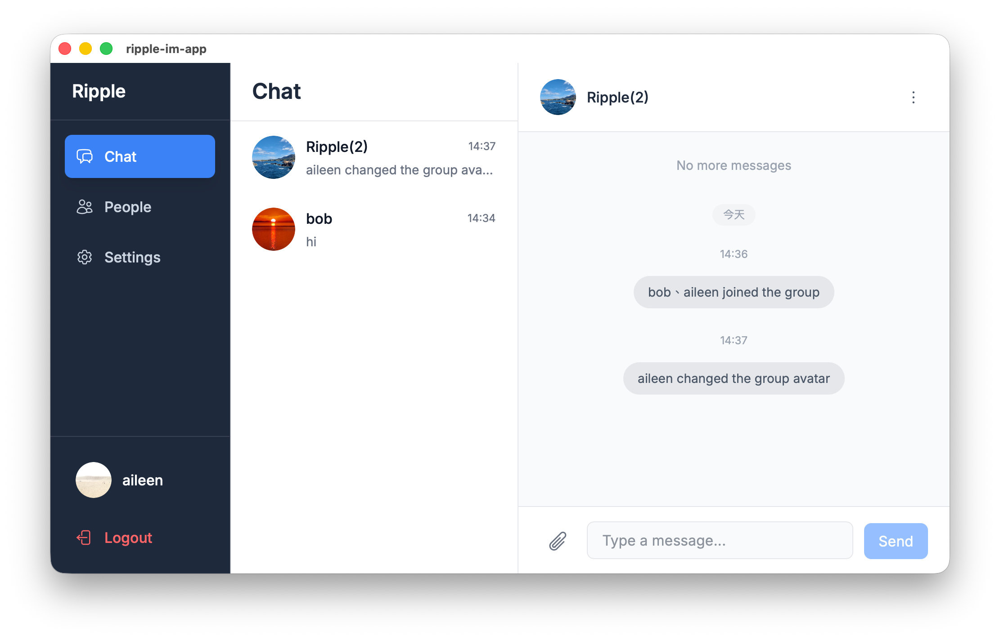
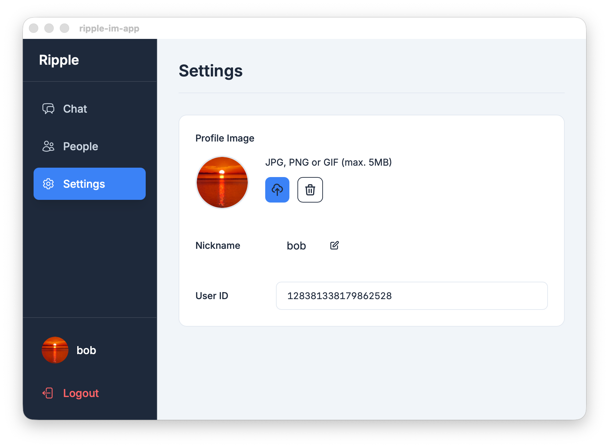
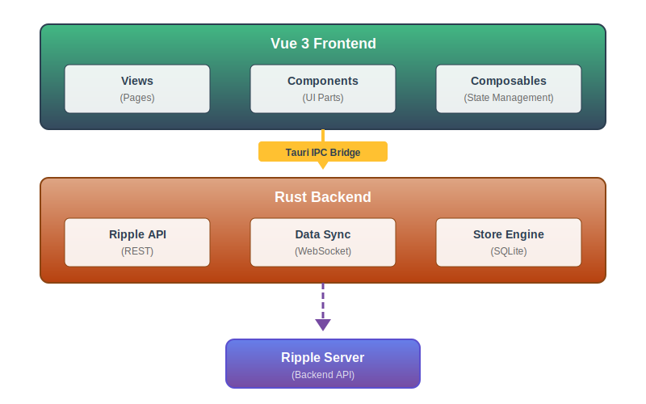

# Ripple IM App

A modern, cross-platform desktop instant messaging application built with Tauri, Vue 3, and Rust.

This is the desktop client for [Ripple IM Server](https://github.com/fanaujie/ripple-im).

---

## Overview

Ripple IM App is a feature-rich desktop messaging application designed for secure, real-time communication. It supports
one-on-one conversations, group chats, file sharing, and comprehensive contact management - all with a focus on privacy
and a seamless user experience.

---

## Features

### Splash Screen

A polished splash screen greets users on application launch.



### Authentication

Secure OAuth2-based authentication with session persistence and encrypted token storage using the system keyring.

> **Note:** Clicking "Sign Up" or "Sign In" will open your default browser for secure authentication via OAuth2.

<table><tr>
<td valign="top"></td>
<td valign="top"></td>
</tr></table>

### Real-time Messaging

Instant message delivery via WebSocket with support for text messages, file attachments, and images.



### Group Chat

Create and manage group conversations with member invitations, group settings, and real-time updates.



### Contact Management

Manage your friends list, handle friend requests, and block unwanted contacts with ease.


### User Settings

Customize your profile with avatar upload (with interactive cropping) and nickname settings.



### Additional Features

- **File Sharing** - Send and receive files with download support
- **Image Preview** - View images in an interactive modal viewer
- **Unread Counts** - Track unread messages per conversation
- **Message History** - Persistent message storage with incremental sync
- **Cross-platform** - Native experience on macOS, Windows, and Linux

---

## Technology Stack

### Frontend

| Technology       | Purpose                           |
|------------------|-----------------------------------|
| **Vue 3**        | UI Framework with Composition API |
| **TypeScript**   | Type-safe development             |
| **Tailwind CSS** | Utility-first styling             |
| **Vite**         | Build tool and dev server         |
| **Vue Router**   | Client-side routing               |

> **Note:** The frontend UI was developed using the **vibe coding** approach - an AI-assisted development methodology
> that emphasizes rapid prototyping and intuitive design iteration.

### Backend

| Technology   | Purpose                                     |
|--------------|---------------------------------------------|
| **Rust**     | Core application logic                      |
| **Tauri v2** | Desktop framework and native APIs           |
| **Axum**     | OAuth callback server                       |
| **Tokio**    | Async runtime                               |
| **SQLx**     | Database queries with compile-time checking |

### Data & Communication

| Technology             | Purpose                      |
|------------------------|------------------------------|
| **SQLite + SQLCipher** | Encrypted local database     |
| **WebSocket**          | Real-time message delivery   |
| **Protocol Buffers**   | Binary message serialization |
| **OS Keyring**         | Secure credential storage    |

---

## Architecture



---

## Getting Started

### Installation

```bash
# Install dependencies
npm install
```

### Development

```bash
# Start the development server with hot reload
npm run tauri dev
```

This command launches both the Vite dev server for the frontend and the Tauri development build.

> **Note:** You need to run the [Ripple IM Server](https://github.com/pura-panel/ripple-im) before starting the client.

---

## Configuration

The application uses environment-specific configuration files located in `src-tauri/resources/`:

- `dev_app_config.json` - Development environment

### Environment Variables

| Variable            | Description                                           |
|---------------------|-------------------------------------------------------|
| `RIPPLE_INSTANCE`   | Run multiple instances with separate data directories |
| `RIPPLE_HTTP_PROXY` | HTTP proxy URL for network requests                   |

---

## License

MIT License

